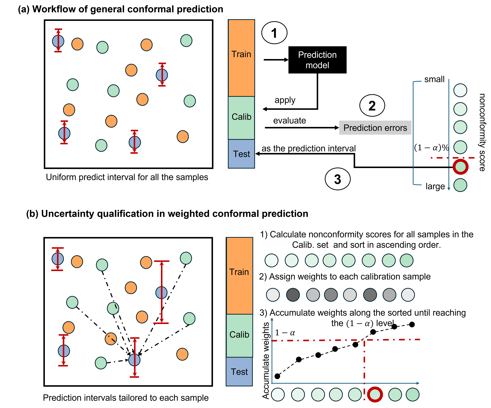
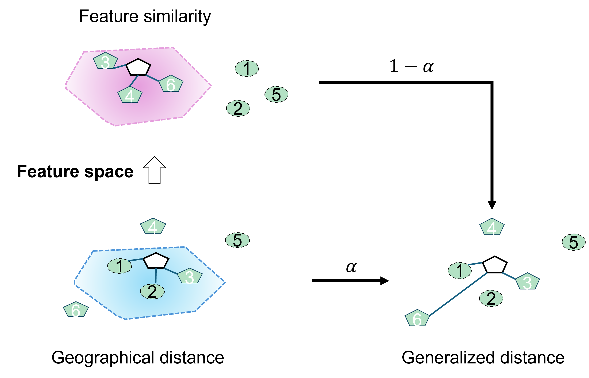
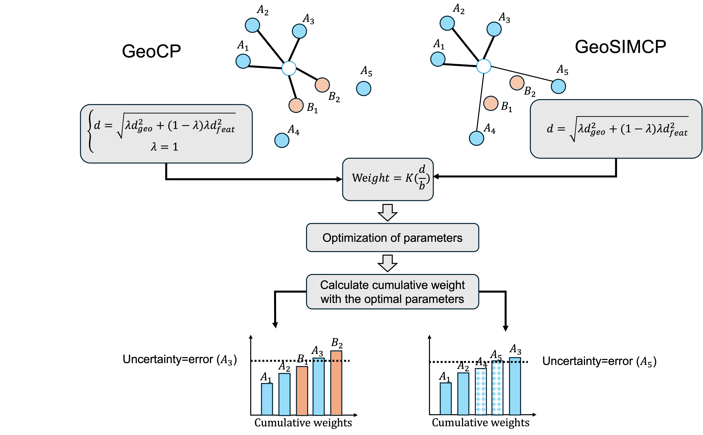

# geoconformal

[](https://opensource.org/licenses/MIT)
[](https://www.python.org/downloads/)
[](https://pypi.org/project/geoconformal/)
[](https://pepy.tech/project/geoconformal)
[](https://pypi.org/project/geoconformal/)
[](https://github.com/pengtum/geoconformal)

**Model-agnostic uncertainty quantification for geospatial prediction.**

`geoconformal` provides prediction intervals for any spatial prediction model (XGBoost, Random Forest, Neural Networks, etc.) without modifying the model itself. It implements two methods:

| Method | Class | When to use |
|--------|-------|-------------|
| **GeoCP** | `GeoConformalSpatialRegression` | Spatial interpolation, or when only coordinates are available |
| **GeoSIMCP** | `GeoSIMConformalSpatialRegression` | Spatial regression with features, especially with nonstationary processes |

## Installation

```bash
pip install geoconformal
```

Requires Python >= 3.7. Dependencies: `numpy`, `scikit-learn`, `scipy`, `pandas`, `geopandas`.

---

## Quick Start

### Step 1: Train your prediction model (any model works)

```python
from sklearn.ensemble import RandomForestRegressor

model = RandomForestRegressor(n_estimators=100, random_state=42)
model.fit(X_train, y_train)
```

### Step 2: Quantify uncertainty with GeoCP

```python
from geoconformal import GeoConformalSpatialRegression

geo_cp = GeoConformalSpatialRegression(
    predict_f=model.predict,    # your model's predict function
    bandwidth=2.0,              # kernel bandwidth
    miscoverage_level=0.1,      # 0.1 = 90% prediction interval
    coord_calib=coords_calib,   # calibration set coordinates, shape (n, 2)
    coord_test=coords_test,     # test set coordinates, shape (m, 2)
    X_calib=X_calib,            # calibration features
    y_calib=y_calib,            # calibration true values
    X_test=X_test,              # test features
    y_test=y_test,              # test true values
)

results = geo_cp.analyze()
```

That's it. `results` contains everything you need.

---

## Understanding the Concepts

### What is Conformal Prediction?

Traditional machine learning models give you a **single predicted value** (e.g., "the house price is $500K"). But how confident is that prediction? Conformal prediction answers this by providing a **prediction interval** (e.g., "the house price is between $450K and $550K, with 90% confidence").

The figure below illustrates the workflow. **(a) Standard Conformal Prediction** treats all calibration residuals equally to compute a single global quantile. **(b) Weighted Conformal Prediction (GeoCP/GeoSIMCP)** assigns location-specific weights so each test point gets its own prediction interval.

<p align="center">
  
</p>

The key idea:
1. **Train** your model on training data
2. **Calibrate**: compute residuals (prediction errors) on a held-out calibration set
3. **Quantify**: use the **weighted** distribution of residuals to build intervals for new test points

### What makes GeoCP special?

Standard conformal prediction treats all calibration residuals equally. But in spatial data, **nearby locations tend to behave similarly** (Tobler's First Law of Geography). GeoCP assigns **higher weights to geographically closer** calibration points when computing the prediction interval for each test location.

This means each test point gets its own **location-specific** prediction interval, reflecting the local uncertainty structure.

### What makes GeoSIMCP different from GeoCP?

GeoCP only considers **geographic distance**. But sometimes nearby locations have very different characteristics. For example, two adjacent properties might be in different land-use zones (residential vs. commercial), leading to very different price distributions despite being close in space.

The figure below shows the key difference. In the left panel (**GeoCP**), the hollow test point is weighted by geographic distance alone, so calibration samples from a different spatial process (pink region) receive high weights simply because they are nearby. In the right panel (**GeoSIMCP**), feature similarity is also considered, so calibration samples that are process-consistent (blue region) contribute more, even if they are farther away.

<p align="center">
  
</p>

GeoSIMCP measures similarity using **both geographic distance AND feature similarity**:

```
d_joint = sqrt( lambda * d_geo^2 + (1 - lambda) * d_feat^2 )
```

- When `lambda = 1.0`: only geographic distance matters (equivalent to GeoCP)
- When `lambda = 0.0`: only feature similarity matters
- When `0 < lambda < 1`: both contribute

### Full Workflow of GeoSIMCP

The figure below shows the complete GeoSIMCP pipeline. For GeoCP (left), only the bandwidth parameter `b` is optimized. For GeoSIMCP (right), both `b` and the trade-off parameter `lambda` are jointly optimized via grid search to minimize the interval score while maintaining valid coverage.

<p align="center">
  
</p>

---

## Example Notebook

A complete step-by-step tutorial is available at **[`example/geoconformal_tutorial.ipynb`](example/geoconformal_tutorial.ipynb)**, covering:
- GeoCP and GeoSIMCP usage with the Seattle housing dataset
- Hyperparameter tuning (grid search with visualization)
- Spatial mapping of predictions and uncertainty

---

## Data Preparation

The package expects your data to be split into three sets:

```
Full Dataset
  |-- Training set (e.g., 80%)    --> used to train your prediction model
  |-- Calibration set (e.g., 10%) --> used by geoconformal to compute residuals
  |-- Test set (e.g., 10%)        --> where you want uncertainty estimates
```

Example split:

```python
from sklearn.model_selection import train_test_split

# First split: 80% train, 20% remaining
X_train, X_remain, y_train, y_remain, coords_train, coords_remain = \
    train_test_split(X, y, coords, test_size=0.2, random_state=42)

# Second split: 50/50 of remaining = 10% calib, 10% test
X_calib, X_test, y_calib, y_test, coords_calib, coords_test = \
    train_test_split(X_remain, y_remain, coords_remain, test_size=0.5, random_state=42)
```

---

## API Reference

### GeoConformalSpatialRegression (GeoCP)

Uses **geographic distance only** to weight calibration residuals.

```python
from geoconformal import GeoConformalSpatialRegression

geo_cp = GeoConformalSpatialRegression(
    predict_f,              # Callable: your model's predict function
    nonconformity_score_f,  # Callable, optional: custom score function
    miscoverage_level,      # float: e.g. 0.1 for 90% intervals
    bandwidth,              # float: Gaussian kernel bandwidth
    coord_calib,            # array (n, 2): calibration coordinates
    coord_test,             # array (m, 2): test coordinates
    X_calib,                # array (n, p): calibration features
    y_calib,                # array (n,): calibration true values
    X_test,                 # array (m, p): test features
    y_test,                 # array (m,): test true values
)
```

### GeoSIMConformalSpatialRegression (GeoSIMCP)

Uses **geographic distance + feature similarity** jointly. All GeoCP parameters apply, plus:

```python
from geoconformal import GeoSIMConformalSpatialRegression

geo_simcp = GeoSIMConformalSpatialRegression(
    predict_f,
    miscoverage_level=0.1,
    bandwidth=2.0,
    coord_calib=coords_calib,
    coord_test=coords_test,
    X_calib=X_calib,
    y_calib=y_calib,
    X_test=X_test,
    y_test=y_test,

    # --- GeoSIMCP-specific parameters ---
    lambda_weight=0.5,            # float in [0, 1], default 1.0
    distance_metric='euclidean',  # 'euclidean' or 'mnd'
    standardize_weights=True,     # z-score normalize features for distance
    X_calib_weight=None,          # optional: separate features for distance
    X_test_weight=None,           # optional: separate features for distance
)
```

### Parameter Details

#### `predict_f` (required)

Your model's prediction function. Must accept a feature matrix and return an array of predictions.

```python
# scikit-learn models
predict_f = model.predict

# Custom function
def my_predict(X):
    return X @ weights + bias
predict_f = my_predict
```

#### `miscoverage_level` (default: 0.1)

Controls the confidence level of prediction intervals.

| Value | Confidence Level | Interval Width |
|-------|-----------------|----------------|
| 0.01  | 99%             | Very wide      |
| 0.05  | 95%             | Wide           |
| **0.1** | **90%**       | **Moderate (recommended)** |
| 0.2   | 80%             | Narrow         |

Lower values = wider intervals = higher coverage but less informative.

#### `bandwidth`

Controls how quickly geographic influence decays with distance. Uses a **Gaussian kernel**: `w = exp(-0.5 * (d / bandwidth)^2)`.

| Bandwidth | Effect |
|-----------|--------|
| Small (e.g., 0.1) | Only very close calibration points matter. Highly localized but potentially unstable. |
| Medium (e.g., 1-3) | Balanced local sensitivity. **Good starting point.** |
| Large (e.g., 5+) | Most calibration points contribute. Smooth but may oversmooth local patterns. |

**Tip**: Use grid search to find the optimal bandwidth. Start with a range like `[0.1, 0.5, 1.0, 2.0, 3.0, 5.0]`.

#### `lambda_weight` (GeoSIMCP only, default: 1.0)

Trade-off between geographic and feature distance.

| Value | Behavior | Use when... |
|-------|----------|-------------|
| 1.0   | Pure geographic distance (= GeoCP) | Spatial interpolation, no features |
| 0.7   | Mostly geographic, some feature | Strong spatial structure with mild heterogeneity |
| 0.5   | Equal weight | Balanced spatial and feature effects |
| 0.3   | Mostly feature, some geographic | Strong feature-driven heterogeneity |
| 0.0   | Pure feature distance | Uncertainty fully determined by feature similarity |

**Tip**: Use grid search over `lambda` in `[0, 0.05, 0.1, ..., 0.95, 1.0]` together with bandwidth.

#### `distance_metric` (GeoSIMCP only, default: 'euclidean')

How feature-space distance is calculated.

- **`'euclidean'`** (EUC): Standard Euclidean distance across all feature dimensions. Works well when features contribute relatively equally.

- **`'mnd'`** (Minimum Normalized Difference): Focuses on the **single most dissimilar feature**. More robust when one dominant feature drives differences between locations (e.g., land-use type).

```python
# Euclidean distance (default)
geo_simcp = GeoSIMConformalSpatialRegression(..., distance_metric='euclidean')

# MND distance
geo_simcp = GeoSIMConformalSpatialRegression(..., distance_metric='mnd')
```

#### `standardize_weights` (GeoSIMCP only, default: True)

When `True`, features used for distance computation are z-score normalized so that all dimensions contribute equally. Only applies when `distance_metric='euclidean'`. Geographic coordinates are **never** standardized (they carry physical meaning).

#### `X_calib_weight` / `X_test_weight` (GeoSIMCP only, optional)

By default, the same features used for prediction (`X_calib`, `X_test`) are used for distance computation. Use these parameters to specify **different features** for distance weighting.

```python
# Use only land-use and elevation for distance, but all features for prediction
geo_simcp = GeoSIMConformalSpatialRegression(
    ...,
    X_calib=X_calib_full,              # all features for prediction
    X_test=X_test_full,
    X_calib_weight=X_calib[['landuse', 'elevation']],  # subset for distance
    X_test_weight=X_test[['landuse', 'elevation']],
)
```

#### `nonconformity_score_f` (optional)

Custom function to measure how "nonconforming" a prediction is. Default: absolute residual `|predicted - actual|`.

```python
# Default (absolute residual)
nonconformity_score_f = None  # uses |pred - gt|

# Custom: squared residual
def squared_residual(pred, gt):
    return (pred - gt) ** 2

geo_cp = GeoConformalSpatialRegression(..., nonconformity_score_f=squared_residual)
```

---

## Working with Results

The `analyze()` method returns a `GeoConformalResults` object:

```python
results = geo_cp.analyze()

# Access individual attributes
results.geo_uncertainty       # array (m,): per-location uncertainty
results.uncertainty           # float: global average uncertainty
results.pred                  # array (m,): predicted values
results.upper_bound           # array (m,): upper bound of interval
results.lower_bound           # array (m,): lower bound of interval
results.coverage_probability  # float: proportion of test points covered

# Convert to GeoDataFrame for mapping
gdf = results.to_gpd()       # GeoDataFrame with geometry column
```

### Visualization Example

```python
import matplotlib.pyplot as plt

gdf = results.to_gpd()

fig, axes = plt.subplots(1, 2, figsize=(14, 5))

# Map 1: Predictions
gdf.plot(column='pred', cmap='RdYlBu_r', legend=True, ax=axes[0])
axes[0].set_title('Predicted Values')

# Map 2: Uncertainty
gdf.plot(column='geo_uncertainty', cmap='Reds', legend=True, ax=axes[1])
axes[1].set_title('Prediction Uncertainty')

plt.tight_layout()
plt.show()
```

---

## Step-by-Step Methods

Instead of `analyze()`, you can run each step individually:

```python
geo_cp = GeoConformalSpatialRegression(...)

# Step 1: Compute uncertainty for each test location
geo_cp.predict_geoconformal_uncertainty()

# Step 2: Build prediction intervals
geo_cp.predict_confidence_interval()

# Step 3: Evaluate coverage
geo_cp.coverage_probability()

# Access results directly
print(f"Coverage: {geo_cp.coverage_proba:.3f}")
print(f"Mean uncertainty: {geo_cp.uncertainty:.3f}")
print(f"Intervals: [{geo_cp.lower_bound[0]:.2f}, {geo_cp.upper_bound[0]:.2f}]")
```

---

## Hyperparameter Tuning

### For GeoCP: tune bandwidth

```python
best_score = float('inf')
best_bw = None

for bw in [0.1, 0.5, 1.0, 2.0, 3.0, 5.0]:
    geo_cp = GeoConformalSpatialRegression(
        predict_f=model.predict, bandwidth=bw, miscoverage_level=0.1,
        coord_calib=coords_calib, coord_test=coords_test,
        X_calib=X_calib, y_calib=y_calib, X_test=X_test, y_test=y_test,
    )
    results = geo_cp.analyze()

    # Interval score: width + penalty for miscoverage
    width = results.upper_bound - results.lower_bound
    alpha = 0.1
    penalty = (2 / alpha) * (
        np.maximum(results.lower_bound - y_test, 0) +
        np.maximum(y_test - results.upper_bound, 0)
    )
    score = np.mean(width + penalty)

    if results.coverage_probability >= 0.9 and score < best_score:
        best_score = score
        best_bw = bw

print(f"Best bandwidth: {best_bw}, interval score: {best_score:.3f}")
```

### For GeoSIMCP: tune bandwidth + lambda

```python
import numpy as np

best_score = float('inf')
best_params = None

for bw in np.linspace(0.1, 5.0, 20):
    for lam in np.arange(0, 1.05, 0.05):
        geo_simcp = GeoSIMConformalSpatialRegression(
            predict_f=model.predict, bandwidth=bw, lambda_weight=lam,
            miscoverage_level=0.1, distance_metric='euclidean',
            coord_calib=coords_calib, coord_test=coords_test,
            X_calib=X_calib, y_calib=y_calib, X_test=X_test, y_test=y_test,
        )
        results = geo_simcp.analyze()

        width = results.upper_bound - results.lower_bound
        alpha = 0.1
        penalty = (2 / alpha) * (
            np.maximum(results.lower_bound - y_test, 0) +
            np.maximum(y_test - results.upper_bound, 0)
        )
        score = np.mean(width + penalty)

        if results.coverage_probability >= 0.9 and score < best_score:
            best_score = score
            best_params = (bw, lam)

print(f"Best bandwidth: {best_params[0]:.2f}, lambda: {best_params[1]:.2f}")
```

---

## Which Method Should I Use?

```
Do you have explanatory features (X)?
  |
  |-- NO  --> Use GeoCP
  |
  |-- YES --> Is the spatial process likely nonstationary?
                |
                |-- Not sure --> Try GeoSIMCP with grid search over lambda.
                |                If optimal lambda = 1.0, GeoCP suffices.
                |
                |-- YES --> Use GeoSIMCP
                              |
                              |-- One dominant differentiating feature?
                              |     --> distance_metric='mnd'
                              |
                              |-- Features contribute relatively equally?
                                    --> distance_metric='euclidean'
```

---

## Citation

If you use this package in your research, please cite:

**GeoCP:**
```bibtex
@article{lou2025geoconformal,
  title={Geoconformal prediction: a model-agnostic framework for measuring the uncertainty of spatial prediction},
  author={Lou, Xiayin and Luo, Peng and Meng, Liqiu},
  journal={Annals of the American Association of Geographers},
  volume={115},
  number={8},
  pages={1971--1998},
  year={2025},
  publisher={Taylor \& Francis}
}
```

**GeoSIMCP:**
```bibtex
@article{luo2025geosimcp,
  title={Quantifying uncertainty in spatial prediction for nonstationary spatial processes},
  author={Luo, Peng},
  journal={Annals of the American Association of Geographers},
  year={2026}
}
```

## License

MIT License
